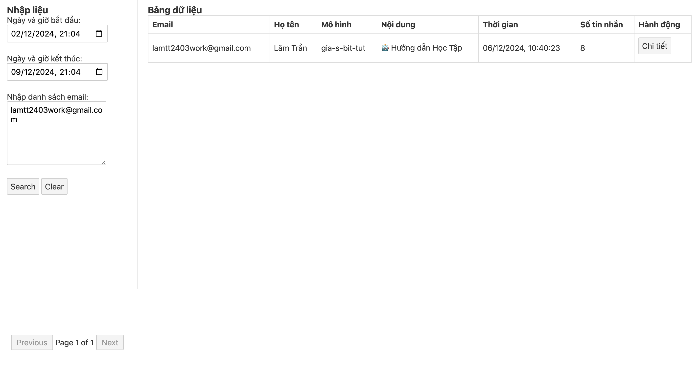
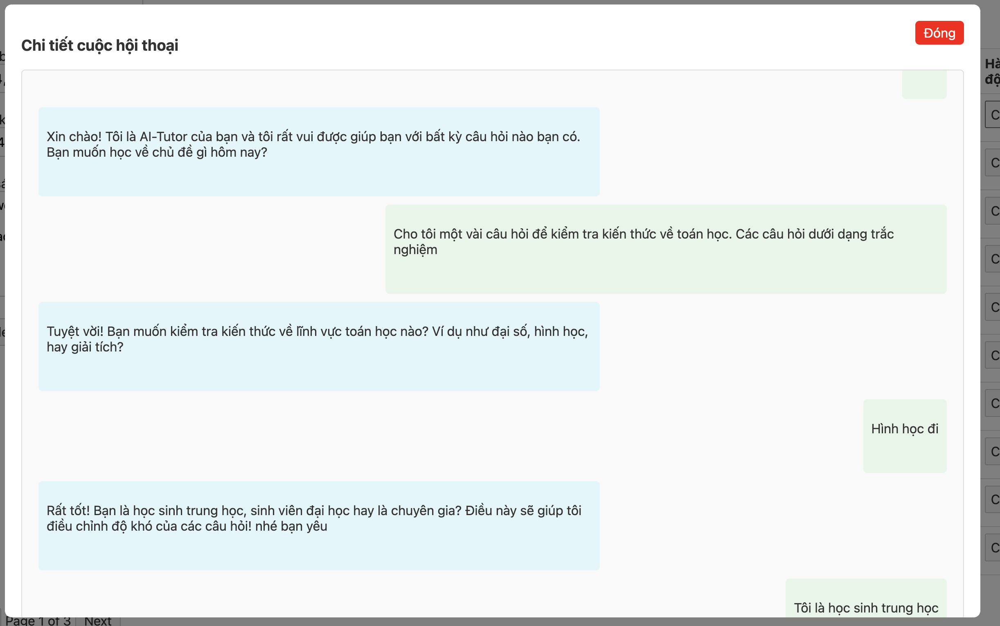

### UI
http://localhost:8080

### How to use
Please enter full input, then click `search`.
> Note: one line per email.

### How to build
#### Step 1: Edit docker-compose
You can update `DATABASE_URL` of backend. Currently, this code support sqlite or postgres.
#### Step 2: Run command
 `docker-compose up -d --build`
